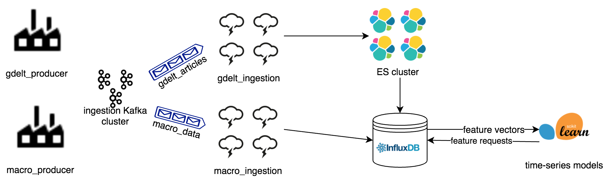

# bigforecast

`bigforecast` is a macro/financial forecasting system completed per the requirements of the Summery 2017 session of "W251: Scaling Up! Really Big Data", part of the [UC-Berkeley Masters of Information in Data Science](https://datascience.berkeley.edu/) program.

# Table of contents
1. [Introduction](#introduction)
2. [Architecture](#architecture)
3. [Repo Structure](#repo)
4. [Installation and Configuration](#installation)
    1. [Provisioning Your Cluster](#provisioning)
    2. [Setting up SSH Access](#ssh)
    3. [Installing Dependencies](#deps)
    4. [Configuring and Starting Kafka](#kafka)
    5. [Configuring and Starting Elasticsearch](#elasticsearch)
    6. [Configuring and Starting InfluxDB](#influx)
5. [Running the App](#running)
    1. [Kicking off Macro Ingestion](#ingestion)
    2. [Kicking off GDELT Ingestion](#ingestion)
    3. [Monitoring Kafka](#monitorkafka)
    4. [Monitoring Elasticsearch](#monitorelastic)
6. [Data Sources](#datasources)
    1. [GDELT](#gdelt)

## Introduction <a name="introduction"></a>

The goal of this project is to create an automated system which produces near-term forecasts of globally important economic / financial time series. The system will create features from a wide variety of data sources and create forecasts using an ensemble of time series models. We will exploit distributed compute and storage technologies to build a system which is always on, evaluating new potential features and constantly updating the deployed forecasting model. We will begin with the daily spot price of crude oil, but hope to expand to other important series.

## Architecture <a name="architecture"></a>

* `conda` - dependency management
* `Elasticsearch` - Distributed document-store used for full-text search and extracting timeseries features from text.
* `Kafka` - Distributed messaging queue.
* `Python 3` - main orchestration tool. Storm bolts, Kafka producer, other miscellaneous tooling.
* `Storm` - Stream processing framework.
* `InfluxDB` - Time series database, used as a short-term store for the data used by our forecasting model. High-frequency data are written to this database and the modeling / validation code uses aggregation queries to test different windowed features.



## Repo Structure <a name="repo"></a>

This repository is kind of big. Before moving on with installation, review this section to get a sense of what lives in each directory.

- `docs/`
  - Project documentation that is more detailed than this `README`. This is mostly informational and not strictly necessary to building the project.
- `elasticsearch/`
  - config files for Elasticsearch. 
  - This directory also includes an [Elasticsearch mapping](https://www.elastic.co/guide/en/elasticsearch/reference/current/mapping.html) for the index we use to hold GDELT articles.
- `influxdb/`
  - config files for InfluxDB
- `kafka/`
  - config files for Kafka
  - Kafka producers that create streams of ingested data
- `python`
  - YAML file with deps for the conda env the entire project is running in
  - Python package with the project source code
- `sandbox`
  - a dumping ground for random exploratory code that is not a part of actually building an instance of the project. This is a place for miscellaneous little scripts and noteboos
- `setup`
  - setup script to be run on each fresh VM. This script will install all major dependencies and overwrite their default configs with those in this repo
  - this directory also contains information like a `hosts` file to match IPs to more friendly host names
- `storm`
  - config files for Storm
  - Storm topologies. Most of the logic for Spouts/Bolts are defined inside the project Python package. The code in this directory is more about scaling and orchestration
- `ui`
  - project front-end code. As of this writing, the "front end" is a Jupyter notebook that can hit the underlying data sources, create a custom dataset, run a model, and produce predictions

## Installation and Configuration <a name="installation"></a>

This application has been tested and developed on [CentOS 7.x](https://wiki.centos.org/Manuals/ReleaseNotes/CentOS7). If you want to use it on other Linux distributions, you should be able to do so by tweaking the scripts in the `setup/` directory.

### Provisioning Your Cluster <a name="provisioning"></a>

To begin, you should provision a cluster of machines. If you are using [IBM Softlayer](http://www.softlayer.com/) and the associated [Python CLI](http://softlayer-python.readthedocs.io/en/latest/cli.html), you can use the commands listed in `setup/provisioning.txt`.

### Setting up SSH access across your cluster <a name="ssh"></a>

Once your machines are provisioned, you'll need to go in and configure secure access between them. You should have a copy of the key you used when running the commands in `setup/provisioning.txt` laying around on your machine. If you called this key "bigforecast", you can log into one of your VMs from your laptop like this:

```
ssh -i root@${INGEST1_IP}
```

where `INGEST1_IP` is the public IP address of the VM you called `ingest1`. You can find this by running the following:

```
slcli vs list
```

You will be prompted for a password for this node. You can find the passwords for all your VMs in the Device Management Console on Softlayer or by running

```
slcli vs credentisl ${VM_ID}
```

where `VM_ID` is the numeric ID (something like "37684921") associated with the VM you want to log into. This is the leftmost column in the result returned by `slcli vs list`.

Once you're into the box, you'll need to update `/etc/hosts` with the information for the other nodes in your cluster. You can see what this looks like in the `setup/network/hosts` file in this repo, although you will have to update this file with the IP addresses assigned to your particular machines.

Run

```
sudo vi /etc/hosts
```

then paste in the information on your particular machines. Exit the file, then run the following to generate SSH keys and copy them to all the other nodes (just hit ENTER through all the prompts):

```
ssh-keygen
for i in ingest1 kafka1 kafka2 kafka3 elasticsearch1 elasticsearch2 elasticsearch3 elasticsearch4 modelbox storm1 storm2 storm3 storm4; do ssh-copy-id $i; done
```

You will be prompted for the root passwords for each host. This process is somewhat manual but will go faster if you put together a small table in a local text file that has the passwords for all the nodes. Don't put that into the repo or even save it, but just have it handy for quick copy-pastes.

Once this is done running, you'll again be able to enter commands. If this worked, you should be able to SSH to other nodes without using a password. Try running `ssh kafka1`, `ssh elasticsearch2`, etc. to see if you can get to all the other nodes.

Repeat this process (updating `/etc/hosts`, creating and copying keys) for each node in the cluster.

### Installing Dependencies <a name="deps"></a>

Now that your machines are provisioned and can talk to each other, it's time to start installing software! Grab a copy of `setup/setup_instance.sh` from this repo and place it on one of your VMs (for this example, let's use `ingest1`). Make it executable, then run it to install all dependencies...that's it! It should take 8-12 minutes to run and should not require you to respond to any prompts.

```
cd ~
chmod a+rwx setup_instance.sh
./setup_instance.sh
```

**NOTE:** The setup script will pull this repo from GitHub into each node it's run on. If you are working on a fork of `jameslamb/bigforecast`, be sure to change the URL inside `setup_instance.sh`.

You will need to run this script for all the other nodes in the cluster. For simplicity and to preserve your sanity, it's strongly recommended that you just install all dependencies on every VM (e.g. don't comment out the Elasticsearch installation on the nodes reserved for the Kafka cluster). You can copy the script to all the other nodes using `scp`:

```
for i in kafka1 kafka2 kafka3 elasticsearch1 elasticsearch2 elasticsearch3 elasticsearch4 modelbox storm1 storm2 storm3 storm4; do scp setup_instance.sh root@$i:/root/; done
```

But that's not all! You can also run commands over `ssh`, so you can install dependencies on each box from the comfort of `ingest1`. Like this:

```
for i in kafka1 kafka2 kafka3 elasticsearch1 elasticsearch2 elasticsearch3 elasticsearch4 modelbox storm1 storm2 storm3 storm4; do ssh root@${i} "bash /root/setup_instance.sh"; done
```

This may make installation a bit slower (since all of the console output from the nodes you're installing deps on will be directed back to `stdout` on `ingest1`) so, alternatively, you could just log into the other machines one at a time and run the installation script.

```
ssh kafka1
./setup_instance.sh

exit

ssh kafka2
./setup_instance.sh

# and so on for all nodes
```

Congratulations! Once this done, every box will have `Elasticsearch`, `Kafka`, `Zookeeper`, `Storm`, `Python 3`, `conda` and a few other things installed! One step closer to the fun stuff.

### Configuring and Staring Kafka <a name="kafka"></a>

The first thing we're going to want to set up is [Apache Kafka](https://kafka.apache.org/). Kafka is a fault-tolerant, distributed message queuing system. In this project, it's used to get newly-arriving data queued up for processing and, eventually, storage in a persistent database.

Some of the details of Kafka installation are handled by `setup/setup_instance.sh`. However, to spin up a cluster for use in this project you'll have to do a few things manually. The following installation instructions draw heavily from [this tutorial](http://armourbear.blogspot.com/2015/03/setting-up-multinode-kafka-cluster.html) and [this other tutorial](https://www.tutorialspoint.com/apache_kafka/apache_kafka_installation_steps.htm).

First, we need to create `myid` files on each node, in the directory where zookeeper will write its data. By default in this project (per `setup/setup_instance.sh`), this is `/data/zookeeper/data`. Log in to `kafka1` and run the following:

```
echo "1" > /data/zookeeper/data/myid
ssh kafka2 "echo \"2\" > /data/zookeeper/data/myid"
ssh kafka3 "echo \"3\" > /data/zookeeper/data/myid"
```

Next, we'll need to give each Kafka node a unique [broker id](http://kafka.apache.org/090/documentation.html). Log in to each Kafka node, open `server.properties`, and set `broker.id` to a different number.

```
sudo vi $HOME/bin/kafka_2.10-0.10.1.1/config/server.properties
```

Again, note that you should set a *DIFFERENT ID* (small integer) on each Kafka node.

Next, let's start up [Zookeeper](https://zookeeper.apache.org/) on each Kafka node. Zookeeper is a resource manager and it's super cool. Run the following command on all three Kafka nodes. Don't worry if you see some exceptions pop up initially...these should go away once all nodes join the cluster. In case you're wondering about this mysterious environment variable...we defined it in `setup/setup_instance.sh`.

```
nohup $KAFKA_HOME/bin/zookeeper-server-start.sh $KAFKA_HOME/config/zookeeper.properties &
```

To confirm that this worked, run

```
cat nohup.out
```

You should see something like this:

```
[2017-08-18 23:17:24,528] INFO tickTime set to 3000 (org.apache.zookeeper.server.ZooKeeperServer)
[2017-08-18 23:17:24,528] INFO minSessionTimeout set to -1 (org.apache.zookeeper.server.ZooKeeperServer)
[2017-08-18 23:17:24,528] INFO maxSessionTimeout set to -1 (org.apache.zookeeper.server.ZooKeeperServer)
[2017-08-18 23:17:24,543] INFO binding to port 0.0.0.0/0.0.0.0:2181 (org.apache.zookeeper.server.NIOServerCnxnFactory)
```

All that's left now is to actually kick off our [Kafka brokers](https://sookocheff.com/post/kafka/kafka-in-a-nutshell/)! Do this on all three Kafka nodes:

```
nohup $KAFKA_HOME/bin/kafka-server-start.sh $KAFKA_HOME/config/server.properties &
```

If, at any point, you need to stop Kafka and change something, run the following command on the relevant VM:

```
cd $KAFKA_HOME/bin && ./kafka-server-stop.sh
```

### Configuring and Starting Elasticsearch <a name="elasticsearch"></a>

As you can see in the architecture diagram above and / or infer from the host names in the provisioning script, this project is designed to use a 4-node [Elasticsearch](https://www.elastic.co/) cluster. This section explains how to get that cluster up and running. It is heavily inspired by [this tutorial for Ubuntu](https://www.digitalocean.com/community/tutorials/how-to-set-up-a-production-elasticsearch-cluster-on-ubuntu-14-04). 

All of the Elasticsearch configuration needed to get up and running is taken care of for you when running `setup_instance.sh`. That script will install Java and Elasticsearch. It will also overwrite the default Elasticsearch configuration files with those tuned to our setup in this project.

To start Elasticsearch and form the cluster, just go into each Elasticsearch node and run the following command:

```
for i in elasticsearch1 elasticsearch2 elasticsearch3 elasticsearch4; do ssh ${i} "sudo systemctl start elasticsearch.service"; done
```

That command will create a cluster and use Elasticsearch's [Discovery](https://www.elastic.co/guide/en/elasticsearch/reference/current/modules-discovery.html) tools to connect all 4 nodes to it. Once you've done this on all four Elasticsearch nodes, your cluster should be up! Log in to any of the Elasticsearch nodes and run the following command:

```
curl -XGET curl -XGET 'http://<host_ip>:9200/_cluster/state?pretty'
```

If this worked correctly, you should see 4 nodes in the "nodes" output. It may look something like this:

```
...
  "nodes" : {
    "6fTZGAuyT6OvLq1_AaLzUQ" : {
      "name" : "elasticsearch1",
      "ephemeral_id" : "sDdnlBNHSFaiL43cE9PLGA",
      "transport_address" : "169.53.131.87:9300",
      "attributes" : { }
    },
    "CnElG-S6RbChpHC6lYSZZw" : {
      "name" : "elasticsearch4",
      "ephemeral_id" : "YM5MUyUPTeKVA-ZmLV_A_Q",
      "transport_address" : "169.53.131.86:9300",
      "attributes" : { }
    },
    "bJVY3g1ZSCWnQq04vZznPw" : {
      "name" : "elasticsearch3",
      "ephemeral_id" : "fFB3CzijSxW3hJks6o6oDw",
      "transport_address" : "169.53.131.94:9300",
      "attributes" : { }
    },
    "_F8K-F8RSVKXcgtsmMBxCw" : {
      "name" : "elasticsearch2",
      "ephemeral_id" : "Ov5iLRt9TcCUxOFPUY8fGw",
      "transport_address" : "169.53.131.83:9300",
      "attributes" : { }
    }
  }
...
```

To view logs for Elasticsearch, you can run the following on one of the VMs running Elasticsearch:

```
tail /var/log/elasticsearch/bigforecast.log
tail /var/log/elasticsearch/elasticsearch.log
```

If you ever need to stop Elasticsearch on one of the nodes, you can log in to the box you want to stop and run this command:

```
sudo systemctl stop elasticsearch.service
```

### Configuring and Starting InfluxDB <a name="influx"></a>

This project uses [InfluxDB](https://www.influxdata.com/) as the serving database for model training. Influx is a time-series DB with really slick semantics for pushing windowed aggregations into the query layer. It also offers excellent compression of time series data.

Almost of the installation details for InfluxDB are taken care of in `setup/setup_instance.sh`, inspired in large part by [this tutorial](http://vmkdaily.ghost.io/influxdb-and-grafana-on-centos/).

Therea are two tiny steps you'll have to do manually. Following the solution [here](https://eapyl.github.io/article/InfluxDB-cant-be-started-as-a-service-21-December-2016.html), SSH into the noded you want to run InfluxDB on and open up `influxdb.service`

```
sudo vi /lib/systemd/system/influxdb.service:
```

Comment out the two lines about "User" and "Group". Your `influxdb.service` will now look something like this:

```
[Unit]
Description=InfluxDB is an open-source, distributed, time series database
Documentation=https://docs.influxdata.com/influxdb/
After=network-online.target

[Service]
#User=influxdb
#Group=influxdb
LimitNOFILE=65536
EnvironmentFile=-/etc/default/influxdb
ExecStart=/usr/bin/influxd -config /etc/influxdb/influxdb.conf ${INFLUXD_OPTS}
KillMode=control-group
Restart=on-failure

[Install]
WantedBy=multi-user.target
Alias=influxd.service
```

Next, we need to configure InfluxDB to take HTTP traffic over its public IP. To do this, we'll edit `influxdb.conf`. Find the `http` section and pass your Influx node's public IP address in the settings.

```
sudo vi /etc/influxdb/influxdb.conf
```

The relevant section may look something like this when you're done:

```
...
[http]
  # Determines whether HTTP endpoint is enabled.
  enabled = true

  # The bind address used by the HTTP service.
  bind-address = "198.11.200.86:8086"
...
```

OK ok enough nonsense, let's start up the DB! To start up InfluxDB, SSH into whichever VM you want (`modelbox`, in this design) and run the following commands. The first command reloads the settings from the configs we just edited. The second one starts up the DB.

```
sudo systemctl daemon-reload
sudo service influxdb start
```

To check if this worked, you can look in the logs:

```
tail /var/log/messages
```

You can also check here:

```
systemctl status influxdb
```

## Running the App <a name="running"></a>

### Kicking Off Macro Ingestion <a name="macro"></a>

If you've reached this point in the instructions, you're ready to start ingesting some data and piping it through the process! The first data source we'll tackle is macroeconomic time series. These data are represented as `(series_name, timestamp, value)` tuples. They require no additional validation and are pulled in batch, so ingestion is simply an always-on Python script that writes directly to InfluxDB.

To begin, log in to `ingest1` and navigate to `$HOME/bigforecast/kafka`. Ingestion of macro data relies on a tiny config file stored at `kafka/macro_config.json`. This has three fields:

- `influx_host` = A string with the IP address of the box you are running InfluxDB on
- `modeldb` = A string with the name of the database inside InfluxDB that you want to write data to
- `tickers` = An array of strings with valid ticker symbols from [Yahoo Finance](https://finance.yahoo.com/lookup/)

Once you've edited this config to your liking, kick off ingestion by running the following commands:

```
cd $HOME/bigforecast/kafka
source activate bigforecast
nohup ./macro_producer.py &
```

If you get errors like "command not found", be sure that the producer script is executable:

```
chmod a+rwx macro_producer.py
```

You can run the following to check that this is running without error:

```
tail nohup.out
```

Once this has been running for a while, you can run something like the example Python code below to check that the data are being written to InfluxDB

```
from influxdb import DataFrameClient
import bigforecast.influx as bgfi
import json
import pandas as pd

# Read in and parse the config
with open('macro_config.json', 'r') as f:
    db_info = json.loads(f.read())

DBNAME = db_info["model_db"]
HOST = db_info["influx_host"]

# Connect to influx with the DataFrameClient
influxDB = bgfi.db_connect(host=HOST, database=DBNAME, client_type = "dataframe")

# List series in the DB
response = influxDB.query("SHOW MEASUREMENTS")
print(response.raw)

# Build a sample dataset
query_string = "SELECT mean(value) from aapl, goog " + \
               "WHERE time > '2017-08-19T00:00:00Z' " + \
               "GROUP BY time(15s)"

result = influxDB.query(query_string)

# Parse into a list of DataFrames, change column names
df_list = []
for name in result.keys():
  thisDF = result[name]
  thisDF.columns = [name]
  df_list.append(thisDF)

# Join the results
trainDF = df_list[0]
if len(df_list) > 1:
  for nextDF in df_list[1:]:
    trainDF = trainDF.join(nextDF)

# Print the results
trainDF
```

In the example above, we exposed a lot of the lower-level details for maximum debuggability. If you just want to play with data and not worry about the details, you could do this:

```
import bigforecast.influx as bgfi


# Connect to the DB
influxDB = bgfi.db_connest(host="169.53.56.26",
                           database="modeldb",
                           client_type="dataframe")

# Get a windowed dataset
trainDF = bgfi.build_dataset(db_client=influxDB,
                             var_list=['aapl', 'goog', 'cad', 'uso'],
                             start_time='2017-08-19 18:00:00',
                             end_time='2017-08-22',
                             window_size='30s')

# Drop NAs in the resulting DataFrame
trainDF = trainDF.dropna(axis=0, how='any')

# Let's take a look
trainDF
```

Congratulations! Your macro/finance data ingestion is up and running!

### Kicking Off GDELT Ingestion <a name="monitorkafka"></a>

Ultimately, GDELT article data will be written to Elasticsearch. It is important to set up the index we'll sink article to **before** writing data there, to ensure that Elasticsearch lays the correct schema on the data. If this is not done, we may not be able to do the types of aggregation and filtering required to build the datasets we want.

Log in to `elasticsearch1` and run the following to create the index:

```
cd $HOME/bigforecast/elasticsearch
curl -X PUT "elasticsearch1:9200/news" -d @gdelt_mapping.json
```

If this worked correctly, you should see `news` listed when running this command:

```
curl -X GET elasticsearch1:9200/_cat/indices
```

The output will look something like this:

```
green open news yKmJKWOGRqWWFqRdIYW_Ig 5 1 1024 26 18.4mb 9.1mb
```

### Monitoring Kafka <a name="monitorkafka"></a>

Our preferred Kafka monitoring tool is Yahoo's [kafka-manager](https://github.com/yahoo/kafka-manager). We've decided not to include it in `setup/setup_instance.sh` but this section details how to install it if you want to do so. After completing the steps detailed in the **Installing Kafka** section, log in to `kafka1` and grab the project repo:

```
cd $HOME/bin && git clone https://github.com/yahoo/kafka-manager
```

You will need to update the `kafka-manager.zkhosts` variable in `conf/application.conf`

```
sudo vi $HOME/bin/kafka-manager/conf/application.conf
```

If you've followed our naming conventions and resource provisioning, change it to this:

```
kafka-manager.zkhosts="kafka1:2181,kafka2:2181,kafka3:2181"
```

From that point forward, just follow the instructions in the [kafka-manager README](https://github.com/yahoo/kafka-manager) and you'll be good to go!

### Monitoring Elasticsearch <a name="monitorelastic"></a>

To monitor Elasticsearch while the app is running, we recommend using [elasticsearch-head](https://github.com/mobz/elasticsearch-head). You can install the app [as a Chrome extension](https://chrome.google.com/webstore/detail/elasticsearch-head/ffmkiejjmecolpfloofpjologoblkegm/), enter the relevant hostname and port in the box at the top, and you're on your way!

## Data Sources <a name="datasources"></a>

### GDELT <a name="gdelt">

The [GDELT 2.0 Event Database](https://blog.gdeltproject.org/gdelt-2-0-our-global-world-in-realtime/) serves as our source of global, potentially market-moving news. In this project, we consume the stream of events coming into `GDELT 2.0` and index them into Elasticsearch. We then use ES queries to create time series feature vectors from the news stories. Detail on the fields available in this dataset can be found in the [GDELT 2.0 Event Database Codebook](http://data.gdeltproject.org/documentation/GDELT-Event_Codebook-V2.0.pdf).

### Yahoo Finance <a name="yahoofinance"></a>

This project relies on macroecomonic and financial time series from [Yahoo Finance](https://finance.yahoo.com/), fetched with the [yahoo-finance Python package](https://github.com/lukaszbanasiak/yahoo-finance). Macro ingestion is treated as a batch process and, for financial time series, is limited to trading days and times when markets are open.
